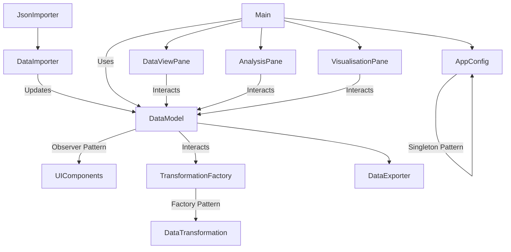

# 📊 Data-Science-Manager 
This project allows users to load csv and json files, manipulate, analyse, and visualise data from the files and then export them, through an intuitive chart GUI 

## 📌 Project Overview 
This JavaFX-based application allows users to **load**, **manipulate**, **analyse**, and **visualise** tabular data through a clean and intuitive user interface. 

It incorporates: 
- **Singleton Pattern**: To ensure a single source of truth for application configuration.
- **Observer Pattern**: To notify UI components when the underlying data changes.
- **Factory Pattern**: For creating various types of data transformations dynamically.
Features include dynamic table rendering, undo/redo support, real-time statistics, and chart visualisation using **JFreeChart**. A suite of **JUnit 5** unit tests has been added for validating core functionality.

---

## 1. Introduction 

This JavaFX-based coursework allows users to load, manipulate, analyse, and visualise data through an intuitive chart GUI. The project utilises the Singleton design pattern to maintain consistent application preferences across sections. Observer to update UI components on data changes and Factory to instantiate transformation objects. The system has a responsive UI, dynamic table generation, real-time statistics and chart visualisations powered by JFree Chart. Included is JUnit tests for all core components of the system 

## ✅ Key Features 

### 📂 Data Import & Export
- Supports **CSV** and **JSON** formats
- Automatic type detection, validation & error handling

### 🔧 Data Transformation
- Filtering rows by condition
- Sorting columns (ascending/descending)
- Aggregation (Sum, Average, Count)
- Full **undo/redo** history for transformation actions

### 🧹 Data Cleaning
- Null value removal
- Duplicate row removal
- Column statistics inspection

### 📈 Data Analysis
- Summary statistics (Mean, Median, Standard Deviation, Min, Max)
- Pearson correlation coefficient between columns

### 📊 Data Visualisation
- Chart types: **Scatter**, **Line**, **Bar**, **Histogram**
- Chart generation via JFreeChart

### 🖥️ User Interface
- Tab-based UI:
  - **Data View**
  - **Analysis**
  - **Visualisation**
- Live updates via observer pattern
- Intuitive controls and responsive layout

---

## 💻 Usage Guide

### 📁 Import Data
- `File` → `Import Data` → Select `.csv` or `.json` file

### 🧽 Clean & Transform
- Use cleaning tools to:
  - Remove nulls
  - Remove duplicates
- Apply transformations:
  - Filter, Sort, Aggregate
  - Use Undo/Redo as needed

### 📊 Analyse Data
- Navigate to **Analysis** tab
- Select columns and run:
  - Summary statistics
  - Correlation checks

### 📉 Visualise
- Navigate to **Visualisation** tab
- Select chart type and data columns
- Click "Create Chart"

### 💾 Export Data
- `File` → `Export Data` → Choose format

---

## 🧰 Technologies Used

| Tool              | Version     |
|-------------------|-------------|
| Java              | 17+         |
| JavaFX            | 17.0.2      |
| Gradle            | Bundled     |
| JUnit             | 5.8.2       |
| JFreeChart        | 1.5.3+      |
| IDE               | IntelliJ IDEA |
| Version Control   | Git         |

## 📐 Software Design Patterns Used

- **Singleton Pattern**: Implemented in `AppConfig.java` for managing application-wide settings like chart type and last used directory.
- **Observer Pattern**: `DataModel` notifies listeners (such as UI panes) when data is changed.
- **Factory Pattern**: `TransformationFactory.java` dynamically creates `DataTransformation` implementations based on input.

---

## 📘 Assumptions

- CSV/JSON files are syntactically correct
- All data fits in memory (no streaming implemented)
- Numeric data is required for most analysis/chart types
- Undo/Redo applies only to transformations, not direct user edits

---

## 🧪 Testing

- JUnit 5 used for unit testing
- Core classes tested:
  - `DataModel`
  - `TransformationFactory`
  - `AppConfig`
  - `JsonImporter`
- Tests include:
  - Statistical calculations
  - Data transformation correctness
  - Edge case handling

---

## 2. Requirements (implemented priority order)
1. Load and display tabular data (CSV/JSON)
2. Apply transformations: Filter, Sort, Aggregate. Undo/Redo system for non-destructive changes
3. Statistical analysis and summary
4. Data visualisation with multiple chart types
5. Export modified datasets

## 3.Design

### Architecture Diagram (Mermaid Syntax Diagram)




### Mermaid Class Diagram


## 🚀 Setup Instructions
## Requirements

1. **Core Requirements**:
    - Java 17 or higher
    - Gradle (Bundled with IntelliJ or via CLI)
    - JavaFX 17.0.2
    - JUnit 5.8.2 (for testing)
    - IntelliJ IDEA
    - Git for version control

2. **Clone the GitLab Repository**
   ```bash
   git clone https://csgitlab.reading.ac.uk/sc016258/CS1OP-CW1

3. **Open in IntelliJ IDEA**
    - Launch IntelliJ IDEA
    - Select 'Open' or `File -> Open` > select the cloned folder
    - Select `build.gradle` file
    - Click "Open as Project" and Select "Trust Project" if prompted
    - IntelliJ will automatically detect the Gradle build and import dependencies.

4. **Configure JDK**
    - Go to `File -> Project Structure`
    - Set SDK to JDK 17 or later
    - Set Language Level to match your JDK

5. **Build the Project**
    - Wait for Gradle to sync dependencies
    - Click Gradle refresh
    - Build using the Gradle task:
      ```bash
      ./gradlew build
      ```

6. **Run the Application**
    - Locate `src/main/java/org/example/courseworkManager/Main.java` or `Main.java` in the project explorer
    - Right-click and select "Run 'Main.main()'"
    - Alternatively, use the Gradle task:
      ```bash
      ./gradlew run
      ```

### Troubleshooting
- If JavaFX modules are not found, ensure they are properly included in the Gradle build file
- For Gradle sync issues, try `File -> Invalidate Caches / Restart`
- If JavaFX libraries are missing, add the following to your build.gradle

 **Actual Hours Spent**: 42 
 **Artificial Intelligence Tools Used**: Chat GPT for design pattern implementation 
 MIT Licensed
