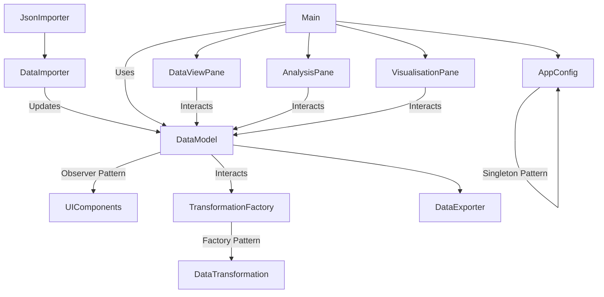
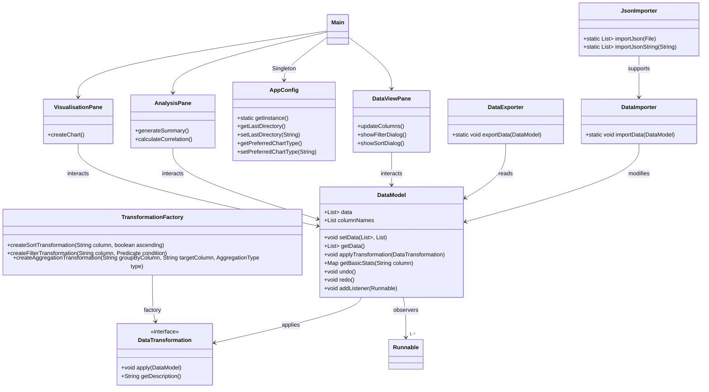

# Data-Science-Manager
This project allows users to load csv and json files, manipulate, analyse, and visualise data from the files and then export them, through an intuitive chart GUI

## 1. Introduction

This JavaFX-based coursework allows users to load, manipulate, analyse, and visualise data through an intuitive chart GUI. 
The project uses the design patterns Singleton to maintain consistent application preferences across sections.
Observer to update UI components on data changes and Factory to instantiate transformation objects.
The system has a responsive UI, dynamic table generation, real-time statistics and chart visualisations powered by JFree Chart.
Included is JUnit tests for all core components of the system  
### Features:

1. **Data Import/Export**: 
    - Support for CSV and JSON file formats with automatic type detection, validation and error handling

2. **Data Transformation**:
    - Filtering
    - Sorting
    - Aggregation (Sum, Average, Count)

3. **Data CLeaning**:
    - Null value removal
    - Duplicate removal
    - Analyse Statistics for specific rows

4. **Data Analysis**:
    - Summary Statistics
    - Mean, Median, SD, Count, Min/Max calculations
    - Pearson correlation

5. **Data Charts**:
    - Scatter
    - Line chart
    - Bar charts
    - Histograms

6. **Undo/Redo Support**: 
    - Complete transformation history management

7. **Modern UI**: Tab-based interface for:
    - Data viewing and editing
    - Analysis
    - Visualization

### How to use
1. **Importing Data**
    - Click File -> Import Data
    - Select a CSV or JSON file

2. **Clean/Transform Data**
   - Remove null values
   - Remove duplicates
   - View column statistics
   - Apply transformations
   - Undo/Redo

3. **Data Analysis**
    - Switch to the Analysis tab
    - Select columns for analysis
    - Calculate correlation
    - Generate summary statistics

4. **Data Visualisation**
    - Switch to the Visualisation tab
    - Select chart type, columns for X and Y axes
    - Click "Create Chart"

5. **Exporting Data**
    - Click File -> Export Data
    - Choose export format (CSV or JSON)

## 2. Requirements (implemented priority order)
1. Load and display tabular data (CSV/JSON)
2. Apply transformations: Filter, Sort, Aggregate. Undo/Redo system for non-destructive changes
3. Statistical analysis and summary
4. Data visualisation with multiple chart types
5. Export modified datasets

## 3.Design

### Architecture Diagram (Mermaid Syntax Diagram)




### Mermaid Class Diagram




## 4. Assumptions
    - CSV/JSON files are well-formed
    - The application assumes data fits in memory
    - JavaFX and IntelliJ is available on the target syste
    - Chart types only display when numeric data is selected.
    - Undo/Redo applies only to transformations, not data entry.


## 🚀 Setup Instructions
## Requirements

1. **Core Requirements**:
    - Java 17 or higher
    - Gradle (Bundled with IntelliJ or via CLI)
    - JavaFX 17.0.2
    - JUnit 5.8.2 (for testing)
    - IntelliJ IDEA
    - Git for version control

2. **Clone the GitLab Repository**
   ```bash
   git clone https://csgitlab.reading.ac.uk/sc016258/CS1OP-CW1

3. **Open in IntelliJ IDEA**
    - Launch IntelliJ IDEA
    - Select 'Open' or `File -> Open` > select the cloned folder
    - Select `build.gradle` file
    - Click "Open as Project" and Select "Trust Project" if prompted
    - IntelliJ will automatically detect the Gradle build and import dependencies.

4. **Configure JDK**
    - Go to `File -> Project Structure`
    - Set SDK to JDK 17 or later
    - Set Language Level to match your JDK

5. **Build the Project**
    - Wait for Gradle to sync dependencies
    - Click Gradle refresh
    - Build using the Gradle task:
      ```bash
      ./gradlew build
      ```

6. **Run the Application**
    - Locate `src/main/java/org/example/courseworkManager/Main.java` or `Main.java` in the project explorer
    - Right-click and select "Run 'Main.main()'"
    - Alternatively, use the Gradle task:
      ```bash
      ./gradlew run
      ```

### Troubleshooting
- If JavaFX modules are not found, ensure they are properly included in the Gradle build file
- For Gradle sync issues, try `File -> Invalidate Caches / Restart`
- If JavaFX libraries are missing, add the following to your build.gradle


**Actual Hours Spent**: 42  
**Artificial Intelligence Tools Used**: Chat GPT for design pattern implementation  

